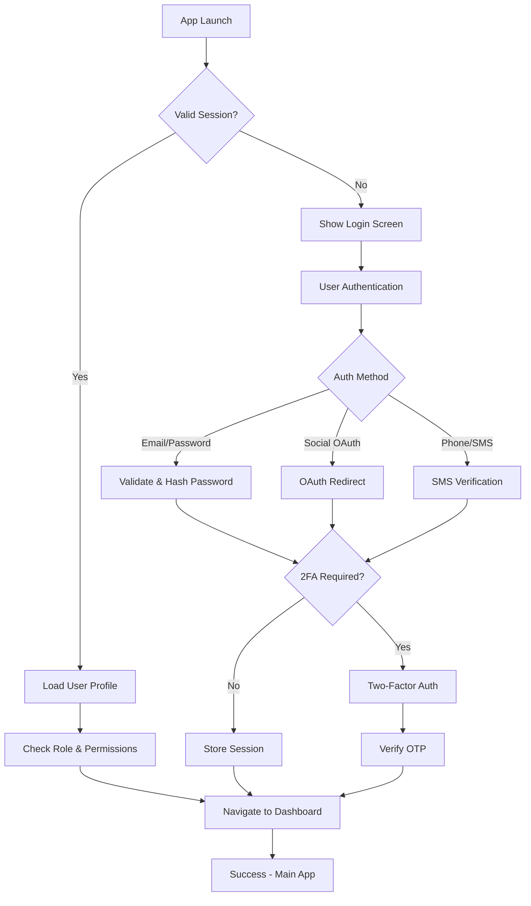

# Implementation Guide - Supabase Authentication System

This document provides detailed implementation information for the Flutter Tutoring App's comprehensive Supabase authentication system.

## 🏗️ Architecture Deep Dive

### 1. Layer Architecture

```
┌─────────────────────────────────────────────────────────┐
│                    Presentation Layer                   │
│  (UI Screens, Widgets, State Management)                │
├─────────────────────────────────────────────────────────┤
│                   Business Logic Layer                  │
│            (Services, Middleware, Utils)                │
├─────────────────────────────────────────────────────────┤
│                   Data Access Layer                     │
│       (Supabase Client, Models, Local Storage)         │
├─────────────────────────────────────────────────────────┤
│                External Services Layer                  │
│          (Supabase Backend, OAuth Providers)           │
└─────────────────────────────────────────────────────────┘
```

### 2. Authentication Flow



## 🔐 Security Implementation Details

### 1. Password Security

```dart
// Password hashing with bcrypt-style implementation
static String hashPassword(String password, String salt) {
  final bytes = utf8.encode(password + salt);
  final digest = sha256.convert(bytes);
  return digest.toString();
}

// Strength validation
static bool isStrongPassword(String password) {
  if (password.length < 8) return false;
  
  final hasLower = password.contains(RegExp(r'[a-z]'));
  final hasUpper = password.contains(RegExp(r'[A-Z]'));
  final hasNumber = password.contains(RegExp(r'[0-9]'));
  final hasSpecial = password.contains(RegExp(r'[!@#$%^&*(),.?":{}|<>]'));
  
  return hasLower && hasUpper && hasNumber && hasSpecial;
}
```

### 2. JWT Token Management

```dart
// Token refresh logic
Future<void> refreshSession() async {
  try {
    final response = await _supabase.auth.refreshSession();
    if (response.session != null) {
      await _storeUserSession(response.session!);
    }
  } catch (e) {
    await signOut(); // Fallback to logout on refresh failure
  }
}

// Token validation with refresh threshold
bool needsRefreshToken(DateTime expiry) {
  final refreshThreshold = DateTime.now().add(Duration(minutes: 5));
  return expiry.isBefore(refreshThreshold);
}
```

### 3. Secure Storage Implementation

```dart
// Platform-specific secure storage
static const FlutterSecureStorage _storage = FlutterSecureStorage(
  aOptions: AndroidOptions(
    encryptedSharedPreferences: true,
  ),
  iOptions: IOSOptions(
    accessibility: KeychainAccessibility.first_unlock_this_device,
  ),
  wOptions: WindowsOptions(
    useBackwardCompatibility: false,
  ),
);

// Token storage with encryption
static Future<void> storeTokens({
  required String accessToken,
  required String refreshToken,
  required DateTime accessTokenExpiry,
  required DateTime refreshTokenExpiry,
}) async {
  final tokenData = {
    'access_token': accessToken,
    'refresh_token': refreshToken,
    'access_token_expiry': accessTokenExpiry.toIso8601String(),
    'refresh_token_expiry': refreshTokenExpiry.toIso8601String(),
  };
  
  await _storage.write(key: _accessTokenKey, value: jsonEncode(tokenData));
}
```

## 🛡️ Role-Based Access Control (RBAC)

### 1. Permission System

```dart
// Role definitions
enum UserRole {
  student('student'),
  tutor('tutor'),
  admin('admin');
}

// Permission mapping
static const Map<String, List<String>> rolePermissions = {
  'student': [
    'view_own_profile',
    'edit_own_profile',
    'search_tutors',
    'book_sessions',
  ],
  'tutor': [
    'view_own_profile',
    'edit_own_profile',
    'create_courses',
    'manage_courses',
    'view_students',
  ],
  'admin': [
    'manage_users',
    'manage_tutors',
    'view_analytics',
    'system_settings',
  ],
};

// Permission check
Future<bool> hasPermission(String userId, String permission) async {
  try {
    final response = await _supabase
        .from('user_permissions')
        .select('*')
        .eq('user_id', userId)
        .eq('permission', permission)
        .single();
    
    return response != null;
  } catch (e) {
    return false;
  }
}
```

### 2. Route Protection

```dart
// Middleware for protected routes
static Widget protectWidget({
  required Widget child,
  UserRole? requiredRole,
  List<String>? requiredPermissions,
  bool requireTwoFactor = false,
}) {
  return FutureBuilder<AuthResult>(
    future: checkAuthentication(
      requiredRole: requiredRole,
      requiredPermissions: requiredPermissions,
      requireTwoFactor: requireTwoFactor,
    ),
    builder: (context, snapshot) {
      if (snapshot.connectionState == ConnectionState.waiting) {
        return LoadingWidget();
      }
      
      if (snapshot.hasError || !snapshot.data!.isSuccess) {
        return UnauthorizedWidget();
      }
      
      return child;
    },
  );
}
```

## 📱 Multi-Factor Authentication (MFA)

### 1. Two-Factor Authentication Setup

```dart
// Enable 2FA
Future<AuthResult> enableTwoFactorAuth({
  required String userId,
  required OTPType type,
}) async {
  try {
    final otpCode = await _generateAndSendOTP(userId, type);
    
    return AuthResult.success(
      message: 'Two-factor authentication enabled. Verification code sent.',
      data: {'otp_code': otpCode}, // For development/testing
    );
  } catch (e) {
    return AuthResult.failure('Failed to enable two-factor auth: $e');
  }
}

// Verify 2FA code
Future<AuthResult> verifyTwoFactorAuth({
  required String userId,
  required String token,
}) async {
  try {
    final isValid = await _verifyOTP(userId, OTPType.twoFactor, token);
    
    if (isValid) {
      await _updateTwoFactorStatus(userId, true);
      return AuthResult.success(
        message: 'Two-factor authentication verified successfully',
      );
    }
    
    return AuthResult.failure('Invalid verification code');
  } catch (e) {
    return AuthResult.failure('Two-factor verification failed: $e');
  }
}
```

### 2. OTP Management

```dart
// Generate and send OTP
Future<String> _generateAndSendOTP(String userId, OTPType type) async {
  final otpCode = _generateOTPCode();
  final identifier = await _getUserIdentifier(userId, type);
  
  await _storeOTP(userId, type, identifier, otpCode);
  await _sendOTP(identifier, otpCode, type);
  
  return otpCode;
}

// Verify OTP
Future<bool> _verifyOTP(String userId, OTPType type, String code) async {
  try {
    final response = await _supabase
        .from('otp_codes')
        .select('*')
        .eq('user_id', userId)
        .eq('type', type.value)
        .single();

    final otp = OTPData.fromJson(response);
    
    if (otp.code == code && otp.isValid) {
      await _markOTPAsUsed(userId, type);
      return true;
    }
    
    return false;
  } catch (e) {
    return false;
  }
}
```

## 🔄 Session Management

### 1. Session Creation & Tracking

```dart
// Create user session
Future<void> _createUserSession(String userId) async {
  final deviceId = await SecureStorage.getDeviceId();
  final session = {
    'user_id': userId,
    'device_id': deviceId,
    'device_info': await _getDeviceInfo(),
    'ip_address': await _getClientIP(),
    'created_at': DateTime.now().toIso8601String(),
    'last_activity': DateTime.now().toIso8601String(),
    'expires_at': DateTime.now().add(SupabaseConfig.refreshTokenExpiry).toIso8601String(),
  };
  
  await _supabase.from('user_sessions').insert(session);
}

// Session validation
bool validateSessionExpiry(DateTime expiry) {
  return DateTime.now().isBefore(expiry);
}

bool shouldRefreshToken(DateTime expiry) {
  final fiveMinutesFromNow = DateTime.now().add(Duration(minutes: 5));
  return expiry.isBefore(fiveMinutesFromNow);
}
```

### 2. Session Cleanup

```dart
// Clear user session
Future<void> _clearUserSession() async {
  await SecureStorage.clearTokens();
  await SecureStorage.clearUserProfile();
}

// Sign out all devices
Future<void> signOutAllDevices() async {
  try {
    await _supabase.auth.signOut(scope: SignOutScope.globally);
    await _clearUserSession();
  } catch (e) {
    throw Exception('Global sign out failed: $e');
  }
}
```

## 🎨 UI/UX Implementation

### 1. Form Validation

```dart
// Email validation
String? validateEmail(String? value) {
  if (value == null || value.isEmpty) {
    return 'Email is required';
  }
  
  final emailRegex = RegExp(r'^[\w-\.]+@([\w-]+\.)+[\w-]{2,4}$');
  if (!emailRegex.hasMatch(value)) {
    return 'Please enter a valid email address';
  }
  
  return null;
}

// Password strength indicator
Widget _buildPasswordStrengthIndicator() {
  final strength = _getPasswordStrength(_passwordController.text);
  final strengthText = _getPasswordStrengthText(strength);
  final strengthColor = _getPasswordStrengthColor(strength);

  return Column(
    children: [
      LinearProgressIndicator(
        value: strength / 4,
        valueColor: AlwaysStoppedAnimation<Color>(strengthColor),
      ),
      Text('Password Strength: $strengthText'),
    ],
  );
}
```

### 2. Biometric Authentication

```dart
// Biometric setup
Future<void> _initializeBiometricAuth() async {
  final isAvailable = await _localAuth.canCheckBiometrics;
  final isEnabled = await SecureStorage.isBiometricEnabled();
  
  if (isAvailable && isEnabled) {
    final isAuthenticated = await _localAuth.authenticate(
      localizedReason: 'Use biometric to access your account',
      options: AuthenticationOptions(
        biometricOnly: true,
        stickyAuth: true,
      ),
    );
    
    if (isAuthenticated) {
      // Auto-login with biometric
      await _autoLoginWithBiometric();
    }
  }
}
```

## 🗄️ Database Schema

### 1. Core Tables

```sql
-- Profiles table (extends auth.users)
CREATE TABLE profiles (
  id UUID PRIMARY KEY REFERENCES auth.users(id) ON DELETE CASCADE,
  email TEXT NOT NULL UNIQUE,
  full_name TEXT,
  avatar_url TEXT,
  role TEXT NOT NULL CHECK (role IN ('student', 'tutor', 'admin')),
  email_verified BOOLEAN DEFAULT false,
  phone_verified BOOLEAN DEFAULT false,
  phone_number TEXT,
  is_active BOOLEAN DEFAULT true,
  created_at TIMESTAMP WITH TIME ZONE DEFAULT NOW(),
  updated_at TIMESTAMP WITH TIME ZONE DEFAULT NOW(),
  metadata JSONB
);

-- User roles
CREATE TABLE user_roles (
  id UUID PRIMARY KEY DEFAULT gen_random_uuid(),
  user_id UUID REFERENCES auth.users(id) ON DELETE CASCADE,
  role TEXT NOT NULL CHECK (role IN ('student', 'tutor', 'admin')),
  assigned_at TIMESTAMP WITH TIME ZONE DEFAULT NOW(),
  UNIQUE(user_id)
);

-- User sessions
CREATE TABLE user_sessions (
  id UUID PRIMARY KEY DEFAULT gen_random_uuid(),
  user_id UUID REFERENCES auth.users(id) ON DELETE CASCADE,
  device_id TEXT,
  device_info TEXT,
  ip_address INET,
  created_at TIMESTAMP WITH TIME ZONE DEFAULT NOW(),
  last_activity TIMESTAMP WITH TIME ZONE DEFAULT NOW(),
  expires_at TIMESTAMP WITH TIME ZONE NOT NULL,
  is_active BOOLEAN DEFAULT true
);

-- OTP codes
CREATE TABLE otp_codes (
  id UUID PRIMARY KEY DEFAULT gen_random_uuid(),
  user_id UUID REFERENCES auth.users(id) ON DELETE CASCADE,
  type TEXT NOT NULL CHECK (type IN ('email_verification', 'phone_verification', 'password_reset', 'two_factor', 'login')),
  identifier TEXT NOT NULL,
  code TEXT NOT NULL,
  expires_at TIMESTAMP WITH TIME ZONE NOT NULL,
  attempts INTEGER DEFAULT 0,
  max_attempts INTEGER DEFAULT 3,
  is_used BOOLEAN DEFAULT false,
  used_at TIMESTAMP WITH TIME ZONE,
  created_at TIMESTAMP WITH TIME ZONE DEFAULT NOW()
);

-- User settings
CREATE TABLE user_settings (
  id UUID PRIMARY KEY DEFAULT gen_random_uuid(),
  user_id UUID REFERENCES auth.users(id) ON DELETE CASCADE,
  two_factor_enabled BOOLEAN DEFAULT false,
  biometric_enabled BOOLEAN DEFAULT false,
  session_timeout_minutes INTEGER DEFAULT 60,
  updated_at TIMESTAMP WITH TIME ZONE DEFAULT NOW(),
  UNIQUE(user_id)
);
```

### 2. Row Level Security (RLS) Policies

```sql
-- Enable RLS
ALTER TABLE profiles ENABLE ROW LEVEL SECURITY;
ALTER TABLE user_roles ENABLE ROW LEVEL SECURITY;
ALTER TABLE user_sessions ENABLE ROW LEVEL SECURITY;
ALTER TABLE user_settings ENABLE ROW LEVEL SECURITY;

-- Profiles policies
CREATE POLICY "Users can view their own profile" ON profiles
  FOR SELECT USING (auth.uid() = id);

CREATE POLICY "Users can update their own profile" ON profiles
  FOR UPDATE USING (auth.uid() = id);

CREATE POLICY "Users can insert their own profile" ON profiles
  FOR INSERT WITH CHECK (auth.uid() = id);

-- User roles policies
CREATE POLICY "Users can view their own role" ON user_roles
  FOR SELECT USING (auth.uid() = user_id);

CREATE POLICY "Admins can manage all roles" ON user_roles
  FOR ALL USING (
    EXISTS (
      SELECT 1 FROM profiles 
      WHERE id = auth.uid() AND role = 'admin'
    )
  );

-- Sessions policies
CREATE POLICY "Users can view their own sessions" ON user_sessions
  FOR SELECT USING (auth.uid() = user_id);

CREATE POLICY "Users can update their own sessions" ON user_sessions
  FOR UPDATE USING (auth.uid() = user_id);
```

## 🔧 Edge Functions

### 1. Custom Authentication Function

```typescript
// supabase/functions/custom-auth/index.ts
import { serve } from "https://deno.land/std@0.168.0/http/server.ts"
import { createClient } from 'https://esm.sh/@supabase/supabase-js@2'

const corsHeaders = {
  'Access-Control-Allow-Origin': '*',
  'Access-Control-Allow-Headers': 'authorization, x-client-info, apikey, content-type',
  'Access-Control-Allow-Methods': 'POST, OPTIONS',
}

serve(async (req) => {
  if (req.method === 'OPTIONS') {
    return new Response(null, { headers: corsHeaders })
  }

  try {
    const { email, password, action } = await req.json()
    const supabaseClient = createClient(
      Deno.env.get('SUPABASE_URL') ?? '',
      Deno.env.get('SUPABASE_ANON_KEY') ?? '',
    )

    let result

    switch (action) {
      case 'signup':
        result = await supabaseClient.auth.signUp({
          email,
          password,
        })
        break
      case 'signin':
        result = await supabaseClient.auth.signInWithPassword({
          email,
          password,
        })
        break
      default:
        throw new Error('Invalid action')
    }

    return new Response(
      JSON.stringify({ data: result }),
      { 
        headers: { ...corsHeaders, 'Content-Type': 'application/json' },
        status: 200,
      },
    )
  } catch (error) {
    return new Response(
      JSON.stringify({ error: error.message }),
      { 
        headers: { ...corsHeaders, 'Content-Type': 'application/json' },
        status: 400,
      },
    )
  }
})
```

### 2. Email/SMS Service Functions

```typescript
// supabase/functions/send-email/index.ts
serve(async (req) => {
  if (req.method === 'OPTIONS') {
    return new Response(null, { headers: corsHeaders })
  }

  try {
    const { to, subject, message, template } = await req.json()
    
    // Integrate with your email service (SendGrid, Mailgun, etc.)
    // For example, using Resend:
    const resend = new Resend(Deno.env.get('RESEND_API_KEY'))
    
    const emailResult = await resend.emails.send({
      from: 'noreply@yourapp.com',
      to,
      subject,
      html: message,
    })

    return new Response(
      JSON.stringify({ data: emailResult }),
      { 
        headers: { ...corsHeaders, 'Content-Type': 'application/json' },
        status: 200,
      },
    )
  } catch (error) {
    return new Response(
      JSON.stringify({ error: error.message }),
      { 
        headers: { ...corsHeaders, 'Content-Type': 'application/json' },
        status: 400,
      },
    )
  }
})
```

## 📊 Performance Optimizations

### 1. Token Caching

```dart
// Cache frequently accessed permissions
class PermissionCache {
  static final Map<String, List<String>> _rolePermissions = {};
  
  static Future<void> cacheRolePermissions(String role) async {
    final permissions = AppConstants.rolePermissions[role] ?? [];
    _rolePermissions[role] = permissions;
  }
  
  static List<String> getRolePermissions(String role) {
    return _rolePermissions[role] ?? [];
  }
  
  static void invalidateCache() {
    _rolePermissions.clear();
  }
}
```

### 2. Connection Pooling

```dart
// Optimized Supabase client configuration
final SupabaseClient _supabase = Supabase.instance.client;

// Connection reuse and keep-alive
Future<void> initializeConnection() async {
  await _supabase.from('profiles').select('id').limit(1);
  // This establishes and maintains the connection
}
```

## 🧪 Testing Strategy

### 1. Unit Tests

```dart
// test/services/auth_service_test.dart
void main() {
  group('AuthService', () {
    late AuthService authService;
    
    setUp(() {
      authService = AuthService();
    });
    
    test('should validate strong password', () {
      expect(
        AuthUtils.isStrongPassword('StrongPassword123!'),
        true,
      );
      expect(
        AuthUtils.isStrongPassword('weak'),
        false,
      );
    });
    
    test('should hash password correctly', () {
      const password = 'testPassword123';
      const salt = 'testSalt';
      
      final hash = AuthUtils.hashPassword(password, salt);
      expect(hash.isNotEmpty, true);
      expect(hash.length, 64); // SHA256 hash length
    });
  });
}
```

### 2. Widget Tests

```dart
// test/widget/login_screen_test.dart
void main() {
  group('LoginScreen', () {
    testWidgets('should show validation errors for invalid input', (tester) async {
      await tester.pumpWidget(
        MaterialApp(
          home: LoginScreen(),
        ),
      );
      
      // Find email and password fields
      final emailField = find.byKey(Key('emailField'));
      final passwordField = find.byKey(Key('passwordField'));
      final loginButton = find.byKey(Key('loginButton'));
      
      // Enter invalid data
      await tester.enterText(emailField, 'invalid-email');
      await tester.enterText(passwordField, '123');
      await tester.tap(loginButton);
      
      await tester.pump();
      
      // Verify validation messages appear
      expect(find.text('Please enter a valid email address'), findsOneWidget);
      expect(find.text('Password must be at least 6 characters'), findsOneWidget);
    });
  });
}
```

### 3. Integration Tests

```dart
// integration_test/auth_flow_test.dart
void main() {
  group('Authentication Flow Integration Tests', () {
    testWidgets('complete signup and login flow', (tester) async {
      // Test the complete user journey
      app.main();
      await tester.pumpAndSettle();
      
      // Navigate to signup
      await tester.tap(find.text('Sign Up'));
      await tester.pumpAndSettle();
      
      // Fill signup form
      await tester.enterText(find.byKey(Key('fullNameField')), 'Test User');
      await tester.enterText(find.byKey(Key('emailField')), 'test@example.com');
      await tester.enterText(find.byKey(Key('passwordField')), 'TestPassword123!');
      
      // Submit signup
      await tester.tap(find.byKey(Key('signupButton')));
      await tester.pumpAndSettle();
      
      // Verify OTP screen appears
      expect(find.text('Verify Your Account'), findsOneWidget);
    });
  });
}
```

## 📈 Monitoring & Analytics

### 1. Authentication Metrics

```dart
// Analytics tracking
class AuthAnalytics {
  static void trackLoginEvent(String method, bool success) {
    // Send to analytics service
    Analytics.track('auth_login', {
      'method': method,
      'success': success,
      'timestamp': DateTime.now().toIso8601String(),
    });
  }
  
  static void trackSecurityEvent(String event, Map<String, dynamic> data) {
    // Send security events to logging service
    SecurityLogger.log(event, data);
  }
}
```

### 2. Performance Monitoring

```dart
// Performance tracking
class AuthPerformance {
  static void trackAuthPerformance(String operation, Duration duration) {
    if (EnvironmentConstants.enablePerformanceMonitoring) {
      Performance.monitor('auth_$operation', duration);
    }
  }
  
  static Future<T> measureAuthOperation<T>(
    String operation,
    Future<T> Function() operation,
  ) async {
    final stopwatch = Stopwatch()..start();
    try {
      final result = await operation();
      stopwatch.stop();
      trackAuthPerformance(operation, stopwatch.elapsed);
      return result;
    } catch (e) {
      stopwatch.stop();
      trackAuthPerformance(operation, stopwatch.elapsed);
      rethrow;
    }
  }
}
```

## 🔄 Continuous Integration/Deployment

### 1. CI/CD Pipeline

```yaml
# .github/workflows/flutter.yml
name: Flutter CI

on:
  push:
    branches: [ main, develop ]
  pull_request:
    branches: [ main ]

jobs:
  test:
    runs-on: ubuntu-latest
    steps:
    - uses: actions/checkout@v3
    - uses: subosito/flutter-action@v2
      with:
        flutter-version: '3.16.0'
    - run: flutter pub get
    - run: flutter analyze
    - run: flutter test
    - run: flutter test integration_test/

  build:
    runs-on: ubuntu-latest
    needs: test
    steps:
    - uses: actions/checkout@v3
    - uses: subosito/flutter-action@v2
    - run: flutter build apk --release
    - uses: actions/upload-artifact@v3
      with:
        name: app-release
        path: build/app/outputs/flutter-apk/app-release.apk
```

### 2. Environment Configuration

```yaml
# environments/development.yaml
supabase_url: "https://dev-project.supabase.co"
supabase_anon_key: "development-anon-key"
enable_debug_mode: true
enable_analytics: false
enable_crash_reporting: false

# environments/staging.yaml
supabase_url: "https://staging-project.supabase.co"
supabase_anon_key: "staging-anon-key"
enable_debug_mode: true
enable_analytics: true
enable_crash_reporting: true

# environments/production.yaml
supabase_url: "https://production-project.supabase.co"
supabase_anon_key: "production-anon-key"
enable_debug_mode: false
enable_analytics: true
enable_crash_reporting: true
```

## 🚀 Deployment Guide

### 1. Production Checklist

- [ ] Update Supabase configuration with production keys
- [ ] Configure OAuth redirect URLs for production
- [ ] Set up SSL certificates for all domains
- [ ] Configure environment variables for production
- [ ] Enable RLS policies in production database
- [ ] Set up monitoring and alerting
- [ ] Configure backup and disaster recovery
- [ ] Test authentication flows in production
- [ ] Set up CI/CD pipeline
- [ ] Configure error tracking and logging

### 2. Security Checklist

- [ ] Enable two-factor authentication for admin accounts
- [ ] Configure rate limiting on authentication endpoints
- [ ] Set up audit logging for security events
- [ ] Enable data encryption at rest and in transit
- [ ] Configure secure session management
- [ ] Set up IP whitelisting for admin access
- [ ] Enable security headers and CSP
- [ ] Configure CORS properly
- [ ] Set up dependency vulnerability scanning
- [ ] Enable automatic security updates

This implementation guide provides the foundation for building a production-ready authentication system with comprehensive security, scalability, and user experience considerations.